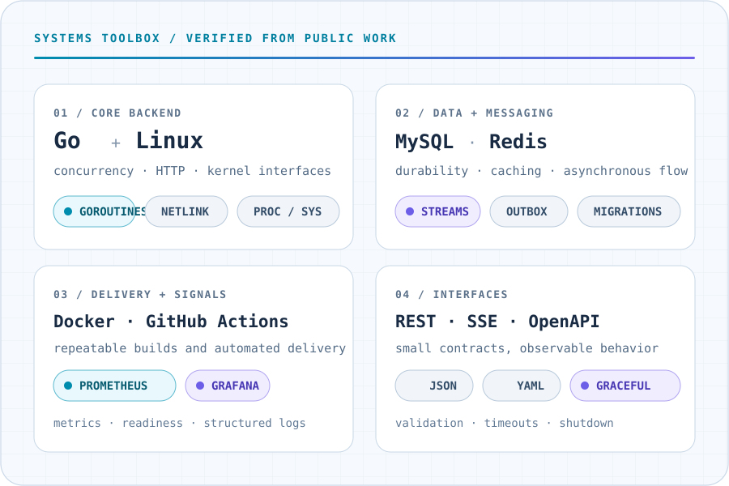

<div align="center">

<picture>
  <source media="(prefers-color-scheme: dark)" srcset="./assets/hero-dark.svg">
  <source media="(prefers-color-scheme: light)" srcset="./assets/hero-light.svg">
  
</picture>

<picture>
  <source media="(prefers-reduced-motion: reduce) and (prefers-color-scheme: dark)"
          srcset="./assets/typing-static-dark.svg">
  <source media="(prefers-reduced-motion: reduce) and (prefers-color-scheme: light)"
          srcset="./assets/typing-static-light.svg">
  <source media="(prefers-color-scheme: dark)" srcset="./assets/typing-dark.gif">
  <source media="(prefers-color-scheme: light)" srcset="./assets/typing-light.gif">
  
</picture>

<br>

<a href="mailto:nickmersad81@gmail.com">Email</a>
&nbsp;·&nbsp;
<a href="https://www.linkedin.com/in/mersad-moghaddam">LinkedIn</a>
&nbsp;·&nbsp;
<a href="https://www.instagram.com/mersad.moghaddam">Instagram</a>
&nbsp;·&nbsp;
<a href="https://x.com/mersadmoghaddam">X</a>

</div>

## `whoami`

```text
$ whoami
Mersad Moghaddam — backend-focused Computer Engineer

$ pwd
Mashhad, Razavi Khorasan, Iran

$ focus
Go · concurrent systems · distributed architecture · observability
```

I build backend systems where correctness is visible, concurrency is deliberate,
and operational behavior is easy to understand. Go is my primary language; the
work I enjoy most sits around APIs, storage, asynchronous processing, system
boundaries, and the trade-offs that appear when software meets production.

### Current engineering focus

- Reading Linux state directly and turning it into predictable operator tooling.
- Designing concurrent and event-driven Go services with explicit failure paths.
- Treating metrics, structured logs, readiness, and graceful shutdown as design inputs.
- Keeping interfaces small enough to reason about and systems boring enough to trust.

## Selected systems

### [SysKit](https://github.com/Mersad-Moghaddam/syskit)

> A read-only Linux intelligence CLI that inspects `/proc`, `/sys`, Netlink, and
> cgroups directly—without shelling out to human-oriented system tools.

**Engineering signal:** a stable Go CLI with layered collectors, structured
table/JSON/YAML output, an interactive terminal dashboard, release automation,
and explicit safety boundaries.

`Go` · `Linux` · `Netlink` · `cgroups` · `terminal UI`

### [Argus](https://github.com/Mersad-Moghaddam/Argus)

> An uptime-monitoring service for HTTP status, keyword, heartbeat, and TLS-expiry
> checks, with incidents, maintenance suppression, and status pages.

**Engineering signal:** hexagonal architecture, MySQL migrations, Redis/Asynq
workers, an outbox-based alert path with deduplication, API-key protection, and
SSRF-aware outbound checks.

`Go` · `MySQL` · `Redis` · `Asynq` · `outbox pattern`

### [WhisperSocial Backend](https://github.com/Mersad-Moghaddam/WhisperSocial-Backend)

> An event-driven social timeline backend split into authentication, post,
> follow, timeline, moderation, and fan-out services.

**Engineering signal:** posts are persisted before Redis Stream publication;
a background worker fans them out to follower timelines while read services
hydrate durable records from MySQL.

`Go` · `microservices` · `Redis Streams` · `MySQL` · `Docker`

### [AetherDB](https://github.com/Mersad-Moghaddam/AetherDB)

> A compact embedded key-value storage experiment built around memory-mapped
> files, an append-oriented data layout, and a lock-free hash index.

**Engineering signal:** explores CAS-based concurrency, explicit durability
trade-offs, `sendfile`-based zero-copy reads, recovery metadata, and benchmark
scenarios with high goroutine counts.

`Go` · `mmap` · `atomic CAS` · `sendfile` · `storage design`

### [Negar](https://github.com/Mersad-Moghaddam/Negar)

> A full-stack reading tracker with a Go/Fiber backend and a React/TypeScript
> interface for libraries, sessions, goals, insights, and reminders.

**Engineering signal:** MySQL and Redis readiness checks, structured Zap logs,
Prometheus-format metrics, JWT access/refresh flows, migrations, CI, and
production-style Docker/nginx deployment.

`Go` · `Fiber` · `MySQL` · `Redis` · `Prometheus`

## Systems toolbox

<picture>
  <source media="(prefers-color-scheme: dark)" srcset="./assets/stack-dark.svg">
  <source media="(prefers-color-scheme: light)" srcset="./assets/stack-light.svg">
  
</picture>

## Engineering principles

```text
correctness     before cleverness
measurement     before optimization
observability   before the first incident
clear contracts before broad abstractions
simple paths    for the common case
explicit costs  for every trade-off
```

I prefer software that fails loudly, recovers deliberately, exposes enough
evidence to debug, and remains understandable after the requirements change.
Fast is valuable; predictable is what lets fast systems stay useful.

## Contribution stream

The animation below is generated by this repository's own scheduled workflow
and published from its `output` branch. Reduced-motion visitors receive a static
local alternative.

<div align="center">

<a href="https://github.com/Mersad-Moghaddam">
  <picture>
    <source media="(prefers-reduced-motion: reduce) and (prefers-color-scheme: dark)"
            srcset="./assets/contributions-static-dark.svg">
    <source media="(prefers-reduced-motion: reduce) and (prefers-color-scheme: light)"
            srcset="./assets/contributions-static-light.svg">
    <source media="(prefers-color-scheme: dark)"
            srcset="https://raw.githubusercontent.com/Mersad-Moghaddam/Mersad-Moghaddam/output/github-snake-dark.svg">
    <source media="(prefers-color-scheme: light)"
            srcset="https://raw.githubusercontent.com/Mersad-Moghaddam/Mersad-Moghaddam/output/github-snake.svg">
    
  </picture>
</a>

</div>

## Let’s build something dependable

If you are working on Go services, systems tooling, APIs, storage, or
observability—and care about the trade-offs behind the implementation—I would
be glad to compare notes.

**[Start a conversation](mailto:nickmersad81@gmail.com)**

<div align="center">

<sub>Explicit boundaries. Useful signals. Predictable production.</sub>

</div>
