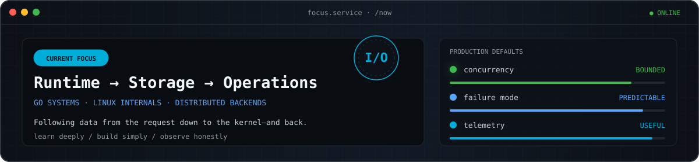
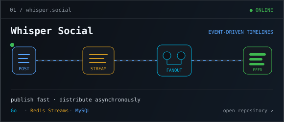
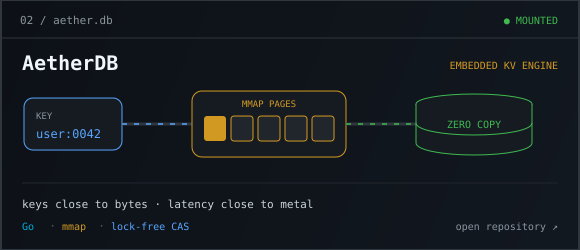
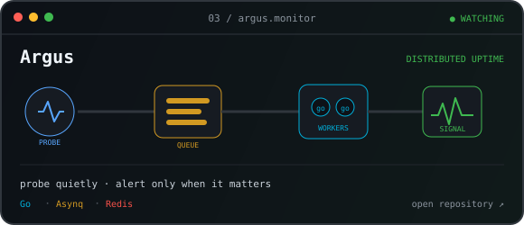
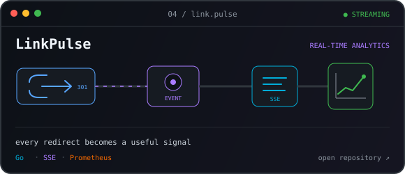
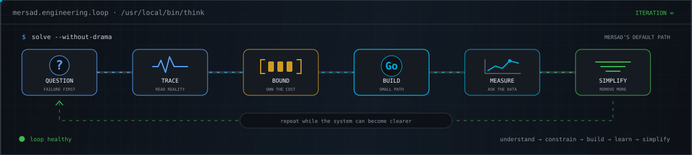
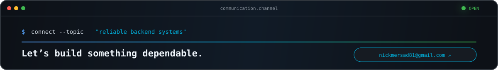

 

[**Email**](mailto:nickmersad81@gmail.com) ·
[**LinkedIn**](https://www.linkedin.com/in/mersad-moghaddam) ·
[**GitHub**](https://github.com/Mersad-Moghaddam) ·
[**X / Twitter**](https://x.com/MersadMoghadam)

  

<!-- ABOUT -->

  

<!-- SELECTED SYSTEMS -->

  

<!-- TOOLKIT -->

  

<!-- LIVE GITHUB SIGNAL -->

  

<!-- GO IN PRODUCTION -->

  

<!-- CONTACT -->

