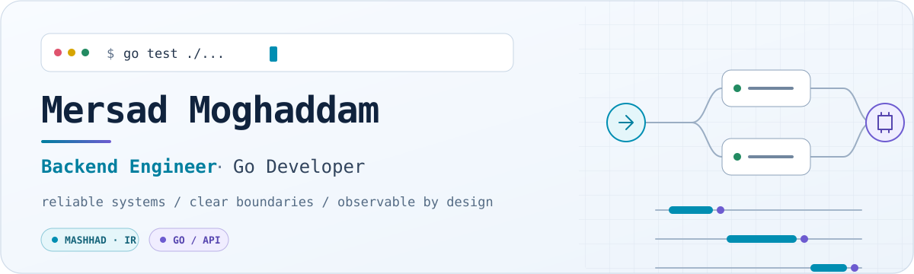
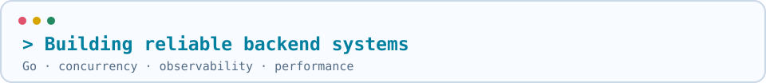

<div align="center">

<picture>
  <source media="(prefers-color-scheme: dark)" srcset="./assets/hero-dark.svg">
  <source media="(prefers-color-scheme: light)" srcset="./assets/hero-light.svg">
  
</picture>

<picture>
  <source media="(prefers-reduced-motion: reduce) and (prefers-color-scheme: dark)"
          srcset="./assets/typing-static-dark.svg">
  <source media="(prefers-reduced-motion: reduce) and (prefers-color-scheme: light)"
          srcset="./assets/typing-static-light.svg">
  <source media="(prefers-color-scheme: dark)" srcset="./assets/typing-dark.gif">
  <source media="(prefers-color-scheme: light)" srcset="./assets/typing-light.gif">
  
</picture>

</div>

---

## 🐹 whoami

```json
{
  "name": "Mersad Moghaddam",
  "role": "Go Backend Developer",
  "based_in": "Mashhad, Iran 🇮🇷",
  "focus": ["concurrency", "clean architecture", "scalability"],
  "currently_building": [
    "TetherYaab-Backend  // feature-first modular monolith",
    "Boshra (apiGolang)  // news ordering platform"
  ],
  "currently_learning": "advanced Go concurrency patterns",
  "fun_fact": "pairs with AI coding agents to ship faster 🤖",
  "status": "compiling... 🛠️"
}
```

- ⚡ I design **reliable, concurrent, and maintainable** backend services in **Go**
- 🏗️ Big fan of **feature-first architecture** over tangled layers
- 🤝 I love pairing with autonomous AI coding agents to move fast without breaking things
- 🌱 Forever curious — always deep-diving into the next `goroutine` rabbit hole
- 📫 Reach me at **nickmersad81@gmail.com**

---

## 🛠️ What I'm Shipping Right Now

| Project | Description |
|:---|:---|
| 🔗 **TetherYaab-Backend** | A feature-first modular Go monolith — dozens of well-organized packages, built for clarity at scale |
| 📰 **Boshra** (`apiGolang`) | A Go-powered news ordering platform connecting reporters, customers & moderators |

---

## 🌐 Let's Connect

<div align="center">

[](https://instagram.com/mersad.moghaddam)
[](https://linkedin.com/in/mersad-moghaddam)
[](https://twitter.com/mersadmoghaddam)
[](mailto:nickmersad81@gmail.com)

</div>

---

## 💻 Tech Stack

<div align="center">

**Primary**


**Languages**


**Frameworks, Platforms & Tools**


</div>

---

## 📊 GitHub Stats

<div align="center">


<br/>


<br/>


</div>

---

## 🏆 Trophy Room

<div align="center">


</div>

---

## 🐍 Contribution Snake *(optional add-on)*

> Add the [Platane/snk](https://github.com/Platane/snk) GitHub Action (~5 min setup) to your `Mersad-Moghaddam/Mersad-Moghaddam` repo to get an animated snake eating your contribution graph. Once it's set up, embed it here — I left it out for now so nothing shows as a broken image before you configure it.

---

## ✍️ Random Dev Wisdom

<div align="center">


</div>

---

<div align="center">

### 👀 Profile Visitors

[](https://visitcount.itsvg.in)

**Thanks for stopping by — let's build something great together 🚀**

</div>
